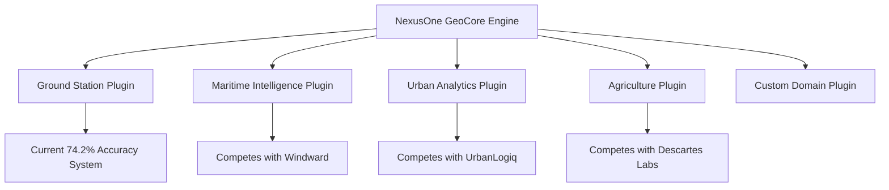

# NexusOne GeoCore Platform - Implementation Plan
## Domain-Agnostic Geospatial Intelligence Engine

### Executive Summary
Transforming the existing ground station intelligence platform (74.2% accuracy) into a domain-agnostic geospatial intelligence core that can serve any vertical through plugins - the "Kubernetes for Geospatial Analytics."

### Current State
- **Existing Asset**: Ground station intelligence platform with proven 74.2% accuracy
- **Technology**: Next.js, TypeScript, Deck.gl, ML with SHAP
- **Strengths**: Validated scoring, reality-based visualization, data integration
- **Opportunity**: Extract domain-agnostic components into reusable platform

### Strategic Vision
**"Write Once, Deploy Everywhere for Geospatial"**



### Implementation Timeline

## Phase 1: Core Foundation (Weeks 1-2) 🚀 IN PROGRESS
**Goal**: Extract and generalize domain-agnostic components

### Week 1: Data & Processing Layers
- [ ] Create nexusone-geocore project structure
- [ ] Build universal geospatial data models
- [ ] Extract spatial operations (buffer, intersect, union)
- [ ] Port statistical functions (Getis-Ord Gi*, IDW)
- [ ] Implement format converters (GeoJSON, Shapefile, KML)

### Week 2: Lakehouse Integration
- [ ] Create Trino/Iceberg connectors
- [ ] Implement lazy data loading
- [ ] Build spatial indexing (R-tree)
- [ ] Add coordinate system transformations
- [ ] Create caching layer

**Deliverable**: Domain-agnostic geospatial engine

## Phase 2: Intelligence Layer (Weeks 3-4)
**Goal**: ML/AI capabilities with explainability

### Week 3: ML Framework
- [ ] Extract feature engineering pipeline
- [ ] Port model training framework (Random Forest + SHAP)
- [ ] Implement spatial cross-validation
- [ ] Create model registry

### Week 4: Explainability
- [ ] Integrate existing SHAP implementation
- [ ] Prepare Shapley-Flow abstraction
- [ ] Port confidence scoring system
- [ ] Build interpretability reports

**Deliverable**: Explainable ML for geospatial

## Phase 3: Plugin Architecture (Weeks 5-6)
**Goal**: Extensible plugin system

### Week 5: Plugin Framework
- [ ] Design plugin interface (GeospatialPlugin base class)
- [ ] Create plugin registry and loader
- [ ] Implement plugin isolation
- [ ] Build plugin communication layer

### Week 6: First Plugins
- [ ] Migrate ground station logic to plugin
- [ ] Create maritime intelligence plugin
- [ ] Extract domain-specific features
- [ ] Package as installable modules

**Deliverable**: Two working plugins proving architecture

## Phase 4: Integration & APIs (Week 7)
**Goal**: Unified interfaces and orchestration

- [ ] Build REST API layer
- [ ] Create GraphQL schema
- [ ] Implement streaming interface
- [ ] Add Python SDK
- [ ] Create DAG orchestrator
- [ ] Set up pipeline versioning

**Deliverable**: Complete API and orchestration layer

## Phase 5: Visualization & Testing (Weeks 8-9)
**Goal**: Production readiness

### Week 8: Visualization
- [ ] Extract Deck.gl components
- [ ] Generalize Cesium integration
- [ ] Create plugin-aware viz system
- [ ] Build adaptive LOD

### Week 9: Testing & Validation
- [ ] Unit tests for core operations
- [ ] Integration tests for plugins
- [ ] Performance benchmarks
- [ ] Validate against baselines

**Deliverable**: Production-ready platform

## Success Metrics

### Technical Metrics
- ✅ Maintain 74.2% accuracy baseline for ground stations
- ⏳ Plugin development time: <1 week per vertical
- ⏳ Analysis latency: <1s for 1M points
- ⏳ Accuracy vs specialized tools: >90%

### Business Metrics
- ⏳ Support 3+ verticals by Week 9
- ⏳ Reduce code duplication by 60%
- ⏳ Enable rapid prototyping for new domains
- ⏳ Platform extensibility proven

## Key Design Decisions

### 1. Extract, Don't Rewrite
- Reuse proven algorithms from existing platform
- Maintain validation and testing
- Preserve 74.2% accuracy achievement

### 2. Lakehouse-First for POC
- Assume data exists in Iceberg tables
- Focus on analytics, not ingestion
- Simplify POC development

### 3. Plugin Everything
- Core has zero domain knowledge
- All vertical logic in plugins
- Clean separation of concerns

### 4. Explainability Mandatory
- Every model must have SHAP
- Confidence scores throughout
- Prepare for Shapley-Flow upgrade

## Risk Mitigation

### Technical Risks
- **Performance**: Mitigated by spatial indexing, caching
- **Compatibility**: Strict plugin interface versioning
- **Complexity**: Incremental migration approach

### Business Risks
- **Timeline**: 9-week plan with clear milestones
- **Validation**: Maintain existing system in parallel
- **Adoption**: Start with proven ground station use case

## Current Sprint (Week 1)

### Today's Tasks
1. ✅ Analyze existing codebase
2. ✅ Create implementation plan
3. 🔄 Update planning documents
4. ⏳ Create nexusone-geocore structure
5. ⏳ Begin extracting core components

### This Week's Goals
- Complete core data layer
- Extract spatial operations
- Set up plugin interface
- Create first integration tests

## File Structure
```
nexusone-geocore/
├── packages/
│   ├── core/
│   │   ├── data/           # Universal models
│   │   ├── processing/     # Spatial operations
│   │   ├── intelligence/   # ML/AI
│   │   └── orchestration/  # Pipeline management
│   ├── plugins/
│   │   ├── ground-station/ # Current system
│   │   └── maritime/       # New plugin
│   ├── api/               # REST/GraphQL
│   ├── sdk/               # Client libraries
│   └── viz/               # Visualization
├── examples/              # Demo applications
├── tests/                # Test suites
└── docs/                 # Documentation
```

## Next Actions
1. Create nexusone-geocore directory structure
2. Set up TypeScript monorepo configuration
3. Begin extracting spatial operations from network-intelligence
4. Create GeospatialEntity base class
5. Implement first format converter

---

*Last Updated: 2025-08-14*
*Status: Implementation Started*
*Baseline Accuracy: 74.2% (to be maintained)*