# Ground Station Investment Intelligence - Production Architecture

## 🏗️ Architecture Overview

This diagram shows the complete production architecture compared to our current POC implementation, highlighting the data flow, integrations, and scalability considerations.

```mermaid
graph TB
    %% External Data Sources
    subgraph "External Data Sources"
        A1[NASA GPM<br/>Precipitation Data]
        A2[Space-Track<br/>Satellite Catalog]
        A3[ITU BRIFIC<br/>Interference Database]
        A4[PeeringDB<br/>Fiber Networks]
        A5[World Bank<br/>Economic Data]
        A6[NOAA Weather<br/>Historical Data]
        
        %% SatOp APIs (Production Only)
        B1[Intelsat API<br/>Link Performance]
        B2[SES mPOWER<br/>Coverage Maps]
        B3[Starlink API<br/>Gateway Planning]
        B4[Viasat API<br/>Network Topology]
        
        %% Commercial Data (Production Only)
        C1[Telegeography<br/>Submarine Cables]
        C2[TelecomTV<br/>Market Intelligence]
        C3[Northern Sky<br/>Satellite Database]
        C4[Comsys<br/>RF Analysis Tools]
    end
    
    %% Data Ingestion Layer
    subgraph "Data Ingestion Pipeline"
        D1[Real-time API Connectors]
        D2[Batch Data Processors]
        D3[ETL Orchestration<br/>Apache Airflow]
        D4[Data Quality Validation]
        D5[Change Detection<br/>& Delta Processing]
    end
    
    %% Storage Layer
    subgraph "Data Storage"
        E1[Time Series DB<br/>InfluxDB/TimescaleDB]
        E2[Graph Database<br/>Neo4j/Amazon Neptune]
        E3[Document Store<br/>MongoDB/DynamoDB]
        E4[Data Lake<br/>S3/Azure Blob]
        E5[Cache Layer<br/>Redis/Memcached]
    end
    
    %% Processing & Analytics
    subgraph "Analytics & ML Pipeline"
        F1[Feature Engineering<br/>Spark/Dask]
        F2[ML Model Training<br/>TensorFlow/PyTorch]
        F3[Statistical Analysis<br/>R/Python/Julia]
        F4[Graph Analytics<br/>NetworkX/igraph]
        F5[Predictive Models<br/>Time Series/ML]
        F6[Risk Assessment<br/>Monte Carlo/Bayesian]
    end
    
    %% Business Intelligence
    subgraph "Investment Intelligence Engine"
        G1[Multi-factor Scoring<br/>Weighted Algorithms]
        G2[Confidence Intervals<br/>Bootstrap/Bayesian]
        G3[Scenario Modeling<br/>What-if Analysis]
        G4[ROI Calculations<br/>Financial Models]
        G5[Risk-Adjusted Returns<br/>Portfolio Theory]
        G6[Competitive Analysis<br/>Market Positioning]
    end
    
    %% API & Services Layer
    subgraph "Application Services"
        H1[REST API Gateway<br/>FastAPI/Django]
        H2[GraphQL Endpoint<br/>Apollo/Hasura]
        H3[WebSocket Streams<br/>Real-time Updates]
        H4[Authentication<br/>OAuth2/JWT]
        H5[Rate Limiting<br/>& API Management]
    end
    
    %% Frontend Applications
    subgraph "User Interfaces"
        I1[Investment Dashboard<br/>React/Vue.js]
        I2[Kineviz GraphXR<br/>Graph Visualization]
        I3[Geographic Maps<br/>Mapbox/Leaflet]
        I4[Mobile Apps<br/>React Native/Flutter]
        I5[Jupyter Notebooks<br/>Data Analysis]
        I6[Power BI/Tableau<br/>Executive Reports]
    end
    
    %% Integration Points
    subgraph "External Integrations"
        J1[Customer CRM<br/>Salesforce/HubSpot]
        J2[Financial Systems<br/>SAP/Oracle]
        J3[Satellite Operators<br/>Direct APIs]
        J4[Regulatory Databases<br/>ITU/FCC/National]
        J5[Market Data<br/>Bloomberg/Reuters]
    end
    
    %% POC Highlights
    subgraph "POC Current State" 
        style POC1 fill:#e1f5fe
        style POC2 fill:#e1f5fe
        style POC3 fill:#e1f5fe
        
        POC1[✅ Static Data Processing<br/>Pandas/NumPy]
        POC2[✅ GraphXR Export<br/>JSON Format]
        POC3[✅ Basic Scoring<br/>Multi-factor Algorithm]
    end
    
    %% Data Flow
    A1 & A2 & A3 & A4 & A5 & A6 --> D1
    B1 & B2 & B3 & B4 --> D1
    C1 & C2 & C3 & C4 --> D2
    
    D1 & D2 --> D3
    D3 --> D4
    D4 --> D5
    D5 --> E1 & E2 & E3 & E4
    
    E1 & E2 & E3 & E4 --> F1
    F1 --> F2 & F3 & F4 & F5 & F6
    
    F2 & F3 & F4 & F5 & F6 --> G1
    G1 --> G2 & G3 & G4 & G5 & G6
    
    G1 & G2 & G3 & G4 & G5 & G6 --> H1
    H1 --> H2 & H3 & H4 & H5
    
    H1 & H2 & H3 --> I1 & I2 & I3 & I4 & I5 & I6
    
    H1 --> J1 & J2 & J3 & J4 & J5
    
    %% Cache connections
    E5 --> H1
    E5 --> I1 & I2 & I3
    
    %% POC connections
    POC1 --> F3
    POC2 --> I2
    POC3 --> G1
    
    %% Styling
    classDef external fill:#fff3e0
    classDef satop fill:#f3e5f5
    classDef commercial fill:#e8f5e8
    classDef processing fill:#e3f2fd
    classDef storage fill:#fce4ec
    classDef analytics fill:#f1f8e9
    classDef intelligence fill:#fff8e1
    classDef api fill:#e0f2f1
    classDef frontend fill:#fafafa
    classDef integration fill:#f9fbe7
    
    class A1,A2,A3,A4,A5,A6 external
    class B1,B2,B3,B4 satop
    class C1,C2,C3,C4 commercial
    class D1,D2,D3,D4,D5 processing
    class E1,E2,E3,E4,E5 storage
    class F1,F2,F3,F4,F5,F6 analytics
    class G1,G2,G3,G4,G5,G6 intelligence
    class H1,H2,H3,H4,H5 api
    class I1,I2,I3,I4,I5,I6 frontend
    class J1,J2,J3,J4,J5 integration
```



## 🎯 POC vs Production Comparison

| Component | POC Implementation | Production Implementation | Enhancement Factor |
|-----------|-------------------|---------------------------|-------------------|
| **Data Sources** | 6 public APIs + synthetic data | 15+ commercial APIs + real-time feeds | 3x more data sources |
| **Data Processing** | Batch pandas processing | Real-time streaming + ML pipelines | 10x faster processing |
| **Storage** | Local files (JSON/Parquet) | Distributed databases + data lake | 100x more scalable |
| **Analytics** | Basic statistical models | Advanced ML + predictive models | 5x more sophisticated |
| **Confidence** | ~70% accuracy | 95%+ accuracy with real data | 25% improvement |
| **Updates** | Manual refresh | Real-time continuous updates | 24/7 live data |
| **Scale** | ~150 ground stations | 10,000+ global facilities | 60x more coverage |
| **Integration** | GraphXR export only | Full API ecosystem | Complete workflow |

## 🔄 Data Pipeline Flow

### 1. **Data Ingestion** (POC: Manual → Production: Automated)
```
POC:        Manual downloads → Local processing → Static files
Production: API connectors → Stream processing → Real-time updates
```

### 2. **Data Quality** (POC: Basic → Production: Enterprise)
```
POC:        Simple validation → Error logging
Production: ML-based validation → Anomaly detection → Auto-correction
```

### 3. **Analytics Engine** (POC: Statistical → Production: AI-Powered)
```
POC:        Weighted scoring → Confidence intervals
Production: ML models → Predictive analytics → Risk modeling
```

### 4. **Investment Intelligence** (POC: Multi-factor → Production: Comprehensive)
```
POC:        7 factor scoring → Bootstrap confidence
Production: 50+ factors → Bayesian inference → Portfolio optimization
```

## 🚀 Scalability Considerations

### **Performance Targets**
- **Query Response**: POC: 5-10 seconds → Production: <100ms
- **Data Freshness**: POC: Daily updates → Production: Real-time
- **Concurrent Users**: POC: 1-5 users → Production: 1000+ users
- **Geographic Coverage**: POC: Sample data → Production: Global coverage

### **Reliability & Availability**
- **Uptime**: POC: Demo environment → Production: 99.9% SLA
- **Disaster Recovery**: POC: None → Production: Multi-region backup
- **Security**: POC: Basic → Production: Enterprise-grade encryption
- **Compliance**: POC: None → Production: SOC2, GDPR, industry standards

## 💡 Value Proposition Enhancement

### **POC Demonstrates:**
✅ **Capability**: "We can integrate diverse data sources"  
✅ **Methodology**: "Our algorithms provide investment insights"  
✅ **Visualization**: "GraphXR provides compelling presentations"  
✅ **Foundation**: "Architecture ready for production scaling"  

### **Production Delivers:**
🎯 **Precision**: 95%+ accuracy with real operator data  
🎯 **Speed**: Real-time decision support  
🎯 **Scale**: Global coverage with local expertise  
🎯 **Integration**: Seamless workflow with existing tools  

## 🛣️ Migration Path

### **Phase 1: POC Enhancement** (Current)
- Enhanced statistical rigor
- Better data quality metrics
- Professional terminology
- Kineviz-ready visualization

### **Phase 2: Pilot Integration** (Next 3 months)
- 2-3 SatOp API integrations
- Cloud deployment (AWS/Azure)
- Real-time data pipeline
- Customer feedback integration

### **Phase 3: Production Scale** (6-12 months)
- Full commercial API integration
- ML model training with real data
- Enterprise security & compliance
- Global deployment & support

This architecture shows how the POC provides a solid foundation while clearly illustrating the enhancement potential with production-grade data and infrastructure.